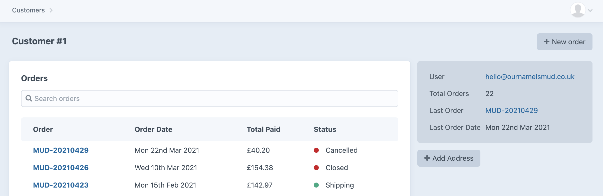

# Address Book plugin for Craft CMS 3.x

Plugin to manage customer addresses independently of Craft Commerce

## Requirements

This plugin requires Craft CMS 3.0.0-beta.23 or later.

## Installation

To install the plugin, follow these instructions.

1. Open your terminal and go to your Craft project:

        cd /path/to/project

2. Then tell Composer to load the plugin:

        composer require ournameismud/address-book

3. In the Control Panel, go to Settings → Plugins and click the “Install” button for Address Book.

## Address Book Overview

This plugin provides an 'Add Address button to customer details page.
This lets users add an address to a customer account without needing to do this as part of the order process.

## Configuring Address Book

The plugin setting can be used to specify what address fields you want shown on the Customer Address form and which of these fields are required. It also lets you specify if you want the Primary Billing and Primary Shipping fields shown.

## Using Address Book

On any customer details page click on the Add Address button shown in the sidebar.

## Address Book Roadmap

* Make fields translatable
* Make fields sortable
* Requried field validation and messaging
* Custom labels for address fields

Brought to you by [@cole007](ournameismud.co.uk)

Plugin icon [Address Book](https://thenounproject.com/search/?q=address+book&i=377085) by [Creative Stall](https://thenounproject.com/creativestall/) from the Noun Project